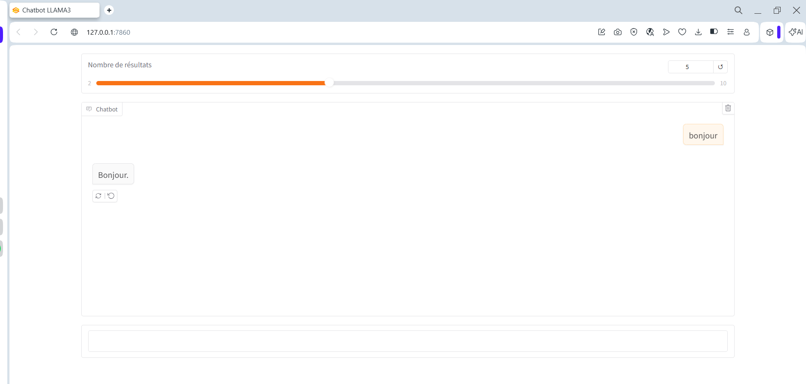

##  Clone the repository:
```bash
git clone https://github.com/saida-chalouach/chatot-with-RAG-Tech.gi
cd Chatbot-with-RAG-and-LangChain
```
## Create a virtual environment
```bash
python -m venv venv
```
## Activate the virtual environment
```bash
venv\Scripts\Activate
```
## Install libraries
```bash
pip install -r requirements.txt
```
## Executing the scripts
```bash 
python ingest_database.py
python app.py
```
## Result
 
 
